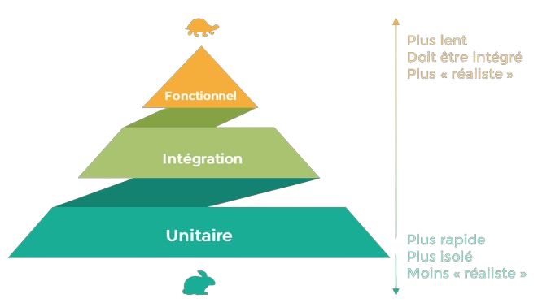

# Introduction aux tests

 <!-- .element width="19%"  align="left" -->

 <!-- .element width="40%"  align="right" -->

----

## Les tests

### Objectif

- Si j'ajoute une feature, j'en casse une autre à l'autre bout du programme !

- L'objectif est d'éviter que ça n'arrive !

----

## Les tests

### Fonctionnement

- Les tests sont rédigés dans le même temps que le code, ou à la validation d'une feature

- Leur rédaction est parfois incluse dans la **D**éfinition de **D**one de la feature

- Ils doivent être exécutés à chaque modification du code !

----

## Les tests

### Concrètement

- Ce sont donc des "scripts" qui vont exécuter le code

- Ils comparent le résultat obtenu avec le résultat attendu (défini par le développeur)

- En cas de différence, le test échoue !

----

## Les tests

### Types de tests

Il existe une multitude de types de tests, parmi lesquels :
- Tests unitaires
- Tests d'intégration
- Tests fonctionnels
- Tests de performance
- Tests de sécurité
- Tests d'acceptation
- etc.

----

## Les tests

### Tests unitaires

- Tests les plus basiques

- On teste **une unité de code** (méthode, classe, ...)

- On **isole** l'unité de code à tester (on ne teste pas les dépendances)

----

## Les tests

### Tests d'intégration

- On teste l'interaction entre **plusieurs unités de code**

- On teste les dépendances

> Exemple : une classe qui en utilise une autre (aggrégation, composition, ...)

----

## Les tests

### Tests fonctionnels

- On teste le comportement d'une **fonctionnalité**

- Ici, on ne teste pas le code, mais le comportement !

> Exemple : Une page spécifique d'une application web

----

## Les tests

### Tests de performance

- On teste la **performance** d'une fonctionnalité

- On teste la **charge** que peut supporter une fonctionnalité

> Exemple : Un site web qui doit supporter 1000 utilisateurs simultanés

----

## Les tests

### Tests de sécurité

- On teste la **sécurité** d'une fonctionnalité

- On teste la **résistance** d'une fonctionnalité face à des attaques

> Exemple : Un site web qui doit résister à des attaques par déni de service

----

## Les tests

### Tests d'acceptation

- On teste la **conformité** d'une fonctionnalité

- On se base sur les attendus du client

> Vous vous souvenez du Gherkin ?

----

## Les tests

### La pyramide des tests

 <!-- .element width="50%" -->

> Largeur = nombre

----

# La suite !

[Retour à l'index](index.html)