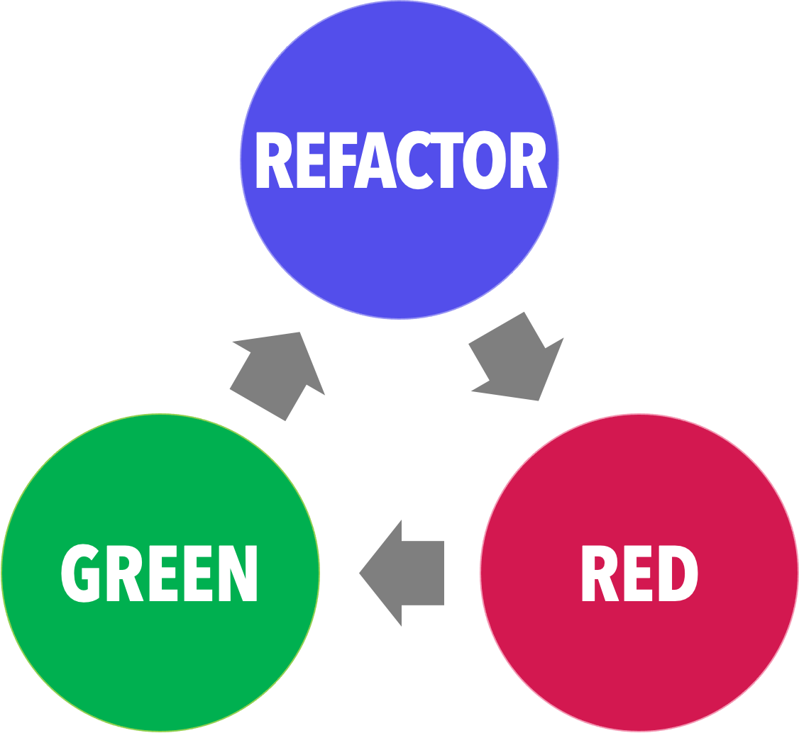

# Tests Unitaires

 <!-- .element width="19%"  align="left" -->

 <!-- .element width="40%"  align="right" -->

----

## Tests unitaires

### Objectif

- L'objectif est de tester une unité de code isolée

- L'isolation assure que si le test échoue, c'est uniquement à cause de l'unité testée et non d'une autre !

---

## Tests unitaires

### FIRST

- FIRST est un acronyme qui définit les bonnes pratiques de tests unitaires

- **F**ast
- **I**solated and **I**ndependent
- **R**epeatable
- **S**elf-validating
- **T**imely

----

## Tests unitaires

### Fast

- Les tests unitaires doivent être rapides à exécuter

- Le temps ne doit pas dissuader le développeur de les exécuter !

> Ils ne doivent pas être une contrainte !

----

## Tests unitaires

### Isolated and Independent

- Les tests unitaires doivent être isolés

- Ils ne doivent pas dépendre d'autres tests, ni de l'environnement

- Ils doivent être indépendants les uns des autres

> Ils doivent pouvoir être exécutés dans n'importe quel ordre !

----

## Tests unitaires

### Repeatable

- On doit pouvoir exécuter un test et avoir le même résultat à chaque fois !

- Pas de dépendance, pas de hasard, pas de date, pas de connexion internet, ...

----

## Tests unitaires

### Self-validating

- Un test doit pouvoir se valider sans intervention humaine

- Un test à la main n'est pas un test unitaire !

> Non, un `console.log` n'est pas un test unitaire !

----

## Tests unitaires

### Timely

- Les tests doivent être rapides

- On teste le fonctionnement, pas les datas !

> On ne teste pas les données, on teste le code !

---

## Tests unitaires

### Les 3 A

Les tests sont découpés en 3 étapes :

- **A**rrange
- **A**ct
- **A**ssert

----

## Tests unitaires

### Arrange

On prépare l'environnement de test : 
- Création des classes nécessaires
- Création des **mocks** (simulations de dépendances)

> `Calculatrice calculette = new Calculatrice();`

----

## Tests unitaires

### Act

On exécute la méthode à tester :
- Appel de la méthode
- Récupération du résultat si nécessaire

> `int resultat = calculette.additionner(2, 2);`

----

## Tests unitaires

### Assert

On vérifie que le résultat obtenu est bien celui attendu :
- Comparaison du résultat avec le résultat attendu

> `assertEquals(4, resultat);`

---

# Tests unitaires

## JUnit

 <!-- .element width="50%"  align="right" -->

 <!-- .element width="10%"  align="left" -->

----

## JUnit

### Présentation

- JUnit est un framework de tests unitaires pour Java

- Il est Open Source et gratuit

- Il permet la création de tests unitaires en Java

> Il est intégré à la plupart des IDE Java !

----

## JUnit

### Installation

- JUnit est disponible sur [Maven Central](https://mvnrepository.com/artifact/org.junit.jupiter/junit-jupiter-api)

- Il peut être ajouté à n'importe quel projet Java !

----

## JUnit

### Emplacement des tests

- Dans un projet Maven, les tests unitaires doivent être placés dans le dossier `src/test/java`

- On reprendra les mêmes packages que dans le dossier `src/main/java`

----

## JUnit

### Structure d'un test

- La classe test reprend le nom de la classe testée, avec le suffixe `Test`

- Un test est une méthode annotée avec `@Test`

- Elle ne prend aucun paramètre et ne retourne rien

- Une méthode de test doit être publique

----

## JUnit

### Exemple

Dans le dossier `src/main/java/fr/octocorn/tu/demo/helloworld` :

```java
public class HelloWorld {

    public String helloWorld() {
        return "Hello World !";
    }
}
```

----

## JUnit

### Exemple

Dans le dossier `src/test/java/fr/octocorn/tu/demo/helloworld` :

```java [0 | 5-6 | 8-9 | 11-12]
public class HelloWorldTest {

    @Test
    public void testHelloWorld() {
        // Arrange : Création de l'instante à tester
        HelloWorld helloWorld = new HelloWorld();

        // Act : Appel de la méthode à tester
        String resultat = helloWorld.helloWorld();

        // Assert : Vérification du résultat
        assertEquals("Hello World !", resultat);
    }
}
```

----

## JUnit

### AssertEquals

- `assertEquals` est une méthode statique de la classe `Assertions`

- Il s'agit d'annoncer ce qui permet au test de réussir

- Ici, il réussit si les deux résultats sont égaux

> J'affirme que le résultat doit être égal à "Hello World !"

----

## JUnit

### AssertEquals

```java
assertEquals(valeurAttendue, valeurObtenue, "messageErreur");
```

- `valeurAttendue` : La valeur attendue
- `valeurObtenue` : La valeur obtenue
- `messageErreur` (facultatif) : Le message d'erreur à afficher si le test échoue

----

## JUnit

### Autres assertions

- `assertEquals` et `assertNotEquals` : Égalité et inégalité

- `assertTrue` et `assertFalse` : Vrai et faux

- `assertNull` et `assertNotNull` : Null et non null

- `assertThrows` : Lève une exception

> Il en existe bien d'autres !

----

## JUnit

### Démonstration !

----

## JUnit

### Hello World !

```java
public class HelloWorld {
    public String sayHello() {
        return "Hello World!";
    }
}
```

```java
public class HelloWorldTest {

    @Test
    public void testHelloWorld() {
        HelloWorld helloWorld = new HelloWorld();
        String resultat = helloWorld.sayHello();
        assertEquals("Hello World!", resultat);
    }
}
```

----

## JUnit

### Calculatrice

`src/main/java/fr/octocorn/tu/demo/calculatrice` 

```java
package fr.octocorn.tu.demo.calculatrice;

public class Calculatrice {
    /**
     * Additionne deux nombres
     *
     * @param premierNombre le premier nombre
     * @param secondNombre le second nombre
     * @return la somme des deux nombres
     */
    public float additionner(float premierNombre, float secondNombre) {
        return premierNombre + secondNombre;
    }


    /**
     * Soustrait deux nombres
     *
     * @param premierNombre le premier nombre
     * @param secondNombre le second nombre
     * @return la différence des deux nombres
     */
    public float soustraire(float premierNombre, float secondNombre) {
        return premierNombre - secondNombre;
    }

    /**
     * Multiplie deux nombres
     *
     * @param premierNombre le premier nombre
     * @param secondNombre le second nombre
     * @return le produit des deux nombres
     */
    public float multiplier(float premierNombre, float secondNombre) {
        return premierNombre * secondNombre;
    }

    /**
     * Divise deux nombres
     *
     * @param premierNombre le premier nombre
     * @param secondNombre le second nombre
     * @return le quotient des deux nombres
     */
    public float diviser(float premierNombre, float secondNombre) {
        return premierNombre / secondNombre;
    }
}
```

----

## JUnit

### Calculatrice

`src/test/java/fr/octocorn/tu/demo/calculatrice` 

```java
public class CalculatriceTest {
    @Test
    public void testAdditionner() {
        Calculatrice calculatrice = new Calculatrice();
        float result = calculatrice.additionner(1, 2);
        assertEquals(3, result);
    }

    @Test
    public void testSoustraire() {
        Calculatrice calculatrice = new Calculatrice();
        float result = calculatrice.soustraire(1, 2);
        assertEquals(-1, result);
    }

    @Test
    public void testMultiplier() {
        Calculatrice calculatrice = new Calculatrice();
        float result = calculatrice.multiplier(1, 2);
        assertEquals(2, result);
    }

    @Test
    public void testDiviser() {
        Calculatrice calculatrice = new Calculatrice();
        float result = calculatrice.diviser(1, 2);
        assertEquals(0.5, result);
    }
}
```

----

## JUnit

### Calculatrice - Refactoring

```java
public class CalculatriceTest {
    // Attribut privé qui doit être initialisé avant chaque test
    // On le place en haut de la classe pour éviter les problèmes de portée
    private Calculatrice calculatrice;
    // Attributs privés qui doivent être initialisés avant chaque test
    private float premierNombre;
    private float secondNombre;

    // Méthode appelée avant chaque test
    // L'annotation @BeforeEach permet de l'identifier
    @BeforeEach
    public void setUp() {
        // Ici, on initialise les attributs
        // NB : ils doivent être déclarés en haut de la classe !
        calculatrice = new Calculatrice();
    }
    
    @Test
    public void testAdditionner() {
        // Arrange
        premierNombre = 1;
        secondNombre = 2;
        
        // Act
        float result = calculatrice.additionner(premierNombre, secondNombre);
        
        // Assert
        assertEquals(3, result);
    }

    @Test
    public void testSoustraire() {
        // Arrange
        premierNombre = 1;
        secondNombre = 2;
        
        // Act
        float result = calculatrice.soustraire(premierNombre, secondNombre);
        
        // Assert
        assertEquals(-1, result);
    }

    @Test
    public void testMultiplier() {
        // Arrange
        premierNombre = 1;
        secondNombre = 2;
        
        // Act
        float result = calculatrice.multiplier(premierNombre, secondNombre);
        
        // Assert
        assertEquals(2, result);
    }

    @Test
    public void testDiviser() {
        // Arrange
        premierNombre = 1;
        secondNombre = 2;
        
        // Act
        float result = calculatrice.diviser(premierNombre, secondNombre);
        
        // Assert
        assertEquals(0.5, result);
    }
}
```

----

## JUnit

### `@BeforeEach`

- `@BeforeEach` est une annotation qui permet d'identifier une méthode qui doit être exécutée avant chaque test

- Elle est utile pour initialiser des attributs

- Il existe également `@BeforeAll`, `@AfterEach` et `@AfterAll`

----

## JUnit

### Nommer les tests

- Le nom de la méthode peut être difficile à lire

- L'annotation `@DisplayName` permet de donner un nom plus explicite au test

```java
@DisplayName("Test de la méthode additionner")
@Test
public void testAdditionner() {
    // ...
}
```

----

## JUnit

### Tests paramétrés

- Plutôt que de créer une méthode de test par cas, on peut utiliser les tests paramétrés

- C'est très utile pour éviter la duplication de code

- On utilise l'annotation `@ParameterizedTest`

----

## JUnit

### Tests paramétrés

- Il faut importer la classe `org.junit.jupiter.params.ParameterizedTest`

- Elle doit être installée dans le projet

```xml
<!-- https://mvnrepository.com/artifact/org.junit.jupiter/junit-jupiter-params -->
<dependency>
    <groupId>org.junit.jupiter</groupId>
    <artifactId>junit-jupiter-params</artifactId>
    <version>5.10.1</version>
    <scope>test</scope>
</dependency>
```

----

## JUnit

### Tests paramétrés - Exemple

```java
// On indique que la méthode est un test paramétré
// On peut donner un nom à ce test
@ParameterizedTest(name = "Test {index} : {0}")
// Définition des paramètres
// ints pour les entiers, strings pour les chaînes de caractères, etc.
@ValueSource(ints = {1, 2, 3, 4, 5})
// Paramètres qui doivent être injectés dans la méthode
public void testSoustraire(int nombre) {
    
    // Act
    float result = calculatrice.soustraire(nombre, nombre);
    
    // Assert
    assertEquals(0, result);
}
```

> Problème : tous les résultats doivent être égaux à 0 !

----

## JUnit

## Tests Paramétrés

- `@ParameterizedTest` permet de définir des paramètres pour un test (remplace `@Test`)
- `@ValueSource` permet de définir les valeurs à tester
- `ints` permet de définir le type des valeurs

----

## JUnit

### Tests paramétrés - CsvSource

```java
@DisplayName("Test des additions")
@ParameterizedTest(name = "Test {index} : {0} + {1} = {2}")
// On définit les paramètres sous forme de csv
@CsvSource({
        "1, 2, 3",
        "2, 3, 5",
        "3, 4, 7",
        "4, 5, 9",
        "5, 6, 11"
})
public void testAdditionner(int premierNombre, int secondNombre, int resultatAttendu) {
    // Act
    float result = calculatrice.additionner(premierNombre, secondNombre);
    
    // Assert
    assertEquals(resultatAttendu, result);
}
```

----

## JUnit

### Tests paramétrés - CsvSource

- `@CsvSource` permet de définir les paramètres sous forme de csv
- `{index}` correspond à l'index du paramètre
- `{0}` correspond au premier paramètre
- `{1}` correspond au second paramètre, etc.

----

## Démonstration ! 

Refactoring des tests de la calculatrice en tests paramétrés

----

## JUnit

### Tests paramétrés - Exemple complet

```java
package fr.octocorn.tu.demo.calculatrice;

import org.junit.jupiter.api.BeforeEach;
import org.junit.jupiter.api.DisplayName;
import org.junit.jupiter.params.ParameterizedTest;
import org.junit.jupiter.params.provider.CsvSource;

import static org.junit.jupiter.api.Assertions.assertEquals;

public class CalculatriceTest {
    // Attribut privé qui doit être initialisé avant chaque test
    // On le place en haut de la classe pour éviter les problèmes de portée
    private Calculatrice calculatrice;

    // Sera exécuté avant chaque test
    @BeforeEach
    public void setUp() {
        calculatrice = new Calculatrice();
    }

    // Nom du test
    @DisplayName("Test des additions")
    // Remplace l'annotation @Test
    // Précise qu'il y a des paramètres
    // On peut aussi donner un nom à chaque paramètre
    // {index} correspond à l'index du paramètre
    // {0} correspond au premier paramètre
    // {1} correspond au second paramètre, etc.
    @ParameterizedTest(name = "Test {index} : {0} + {1} = {2}")
    // On définit les paramètres sous forme de csv
    // Il faut voir un CSV comme un tableau, avec des lignes et des colonnes
    @CsvSource({
            "1, 2, 3",
            "2, 3, 5",
            "3, 4, 7",
            "4, 5, 9",
            "5, 6, 11"
    })
    public void testAdditionner(float premierNombre, float secondNombre, float resultatAttendu) {
        // Act
        float result = calculatrice.additionner(premierNombre, secondNombre);

        // Assert
        assertEquals(resultatAttendu, result);
    }

    @DisplayName("Test des soustractions")
    @ParameterizedTest(name = "Test {index} : {0} - {1} = {2}")
    @CsvSource({
            "1, 2, -1",
            "6, 5, 1",
            "1000, 9, 991",
    })
    public void testSoustraire(float premierNombre, float secondNombre, float resultatAttendu) {

        // Act
        float result = calculatrice.soustraire(premierNombre, secondNombre);

        // Assert
        assertEquals(resultatAttendu, result);
    }

    @DisplayName("Test des multiplications")
    @ParameterizedTest(name = "Test {index} : {0} * {1} = {2}")
    @CsvSource({
            "1, 2, 2",
            "2, 3, 6",
            "3, 4, 12",
            "4, 5, 20",
            "5, 6, 30"
    })
    public void testMultiplier( float premierNombre, float secondNombre, float resultatAttendu) {
        // Act
        float result = calculatrice.multiplier(premierNombre, secondNombre);

        // Assert
        assertEquals(resultatAttendu, result);
    }

    @DisplayName("Test des divisions")
    @ParameterizedTest(name = "Test {index} : {0} / {1} = {2}")
    @CsvSource({
            "1, 2, 0.5",
            "6, 5, 1.2",
            "1000, 10, 100"
    })
    public void testDiviser(float premierNombre, float secondNombre, float resultatAttendu) {
        // Act
        float result = calculatrice.diviser(premierNombre, secondNombre);

        // Assert
        assertEquals(resultatAttendu, result);
    }
}
```

----

## JUnit

### Test des exceptions

> Faut-il tester/anticiper les exceptions ?

----

## JUnit

### Test des exceptions

Oui... Et non :
- Les exceptions sont des cas particuliers
- Elles doivent être testées uniquement si elles sont susceptibles d'être levées

> La question : Est-ce important d'un point de vue métier ?

----

## JUnit

### Test des exceptions

- On testera les erreurs qui représentent un besoin métier uniquement

- Inutile de chercher à anticiper ce qui n'est pas demandé et qui pourrait ne jamais arriver

- Et puis : qu'est-ce qui vous dit que ce n'est pas volontaire ?

> Faites-le en bonne intelligence !

----

## JUnit

### Test des exceptions

- `assertThrows` permet de tester qu'une exception est bien levée

- La syntaxe est un peu particulière

- Elle prend en paramètre la classe de l'exception et une **lambda**

> On peut aussi se baser sur le message d'erreur au lieu de la classe

----

## JUnit

### Test des exceptions - Exemple

Modification de la classe `Calculatrice` :

```java
/**
 * Divise deux nombres
 *
 * @param premierNombre le premier nombre
 * @param secondNombre le second nombre
 * @return le quotient des deux nombres
 */
public float diviser(float premierNombre, float secondNombre) {
    verifierDivisionParZero(secondNombre);
    return premierNombre / secondNombre;
}

/**
 * Vérifie que le second nombre n'est pas égal à zéro
 *
 * @param secondNombre le second nombre
 */
private void verifierDivisionParZero(float secondNombre) throws IllegalArgumentException {
    if (secondNombre == 0) {
        throw new IllegalArgumentException("La division par zéro est impossible");
    }
}
```

----

## JUnit

### Test des exceptions - Exemple

Avec le message d'erreur :

```java
@DisplayName("Test de la division par zéro")
    @ParameterizedTest(name = "Test {index} : {0} / 0")
    @ValueSource(floats = {1, 10, 500, 1000})
    public void testDiviserParZero(float premierNombre) {
        IllegalArgumentException exception;
        
        exception = assertThrows(IllegalArgumentException.class, () -> calculatrice.diviser(premierNombre, 0));
        
        assertEquals("La division par zéro est impossible", exception.getMessage());
    }
```

----

## JUnit

### Test des exceptions - Exemple

Avec la classe de l'erreur :

```java
@DisplayName("Test de la division par zéro")
    @ParameterizedTest(name = "Test {index} : {0} / 0")
    @ValueSource(floats = {1, 10, 500, 1000})
    public void testDiviserParZero(float premierNombre) {
        IllegalArgumentException exception;
        
        exception = assertThrows(IllegalArgumentException.class, () -> calculatrice.diviser(premierNombre, 0));
        
        assertEquals(IllegalArgumentException.class, exception.getClass());
    }
```

----

## JUnit

### Test des exceptions - Exemple

Ou, en utilisant une lambda (à préférer) :

```java
@DisplayName("Test de la division par zéro")
    @ParameterizedTest(name = "Test {index} : {0} / 0")
    @ValueSource(floats = {1, 10, 500, 1000})
    public void testDiviserParZero(float premierNombre) {
        assertThrows(
                IllegalArgumentException.class, 
                () -> calculatrice.diviser(premierNombre, 0)
        );
    }
```

----

## JUnit

### Les méthodes privées

> Faut-il tester les méthodes privées ?

----

## JUnit

### Les méthodes privées

- Les méthodes privées sont des méthodes internes à la classe

- C'est un détail d'implémentation qui ne doit pas être testé

- Les tester revient à casser l'encapsulation !

> On ne teste pas les méthodes privées !

----

## JUnit

### Les méthodes privées

- Attention : Ca ne veut pas dire que ce morceau de logique doit être ignoré !

- On entend juste par là qu'il ne faut pas tester la méthode privée en elle-même

- On vérifiera cependant le comportement de la méthode publique qui l'appelle !

----

## JUnit

### Exemple concrêt

- Notre calculatrice a une méthode publique `diviser`

- Elle appelle une méthode privée `verifierDivisionParZero`

- On ne teste pas la méthode privée, mais on teste la méthode publique !

- On peut cependant s'assurer que la méthode l'exception est bien levée

----

## JUnit

### À vous de jouer !

Réalisez le TP 1 !

----

## JUnit

### MethodSource

- `@MethodSource` permet de définir les paramètres sous forme de méthode

- Elle prend en paramètre le nom de la méthode qui fournit les paramètres

- La méthode doit être statique et retourner un `Stream` de `Arguments`

> Utile pour passer des objets, des tableaux, etc.

----

## JUnit

### MethodSource - Exemple

```java
@DisplayName("Test des additions")
@ParameterizedTest(name = "Test {index} : {0} + {1} = {2}")
@MethodSource("argumentsAdditionner")
public void testAdditionner(float[] nombres) {
    // Act
    float result = calculatrice.additionner(nombres[0], nombres[1]);

    // Assert
    assertEquals(nombres[2], result);
}

private static Stream<Arguments> argumentsAdditionner() {
    return Stream.of(
            Arguments.of((Object) new float[]{1, 2, 3}),
            Arguments.of((Object) new float[]{2, 3, 5}),
            Arguments.of((Object) new float[]{3, 4, 7}),
            Arguments.of((Object) new float[]{4, 5, 9})
    );
}
```
