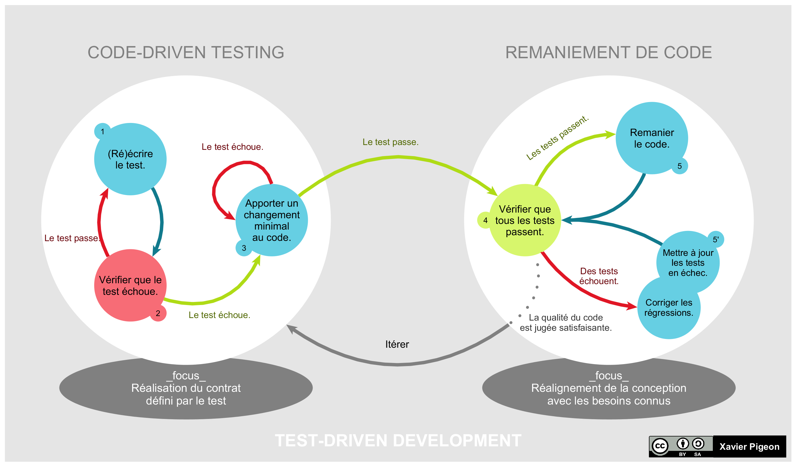

# Test Driven Development

 <!-- .element width="19%"  align="left" -->

 <!-- .element width="40%"  align="right" -->

----

## TDD

### Définition

- **T**est **D**riven **D**evelopment

- Développement piloté par les tests

- Méthodologie de développement

- Basé sur "Red Green Refactor"

----

## TDD

### Origines

- Provient de la méthodologie XP

- **XP** : **E**xtreme **P**rogramming

- Méthodologie agile

----

## TDD

### Principes

- **RED** : Écrire un test qui échoue

- **GREEN** : Écrire le code le plus simple possible pour faire passer le test

- **REFACTOR** : Refactoriser le code

----

## TDD

### RED

- On écrit un test qui échoue

- Il échoue, car le code n'est pas encore écrit

- On décrit de manière simple le comportement attendu

----

## TDD

### GREEN

- On écrit le code le plus simple possible pour faire passer le test

- On ne s'occupe pas de la qualité du code, ni du découpage

- On ne s'occupe pas de la performance

----

## TDD

### REFACTOR

- On refactorise le code pour le rendre plus lisible

- On découpe le code en méthodes, renomme les variables, etc.

- Et on exécute à nouveau les tests pour vérifier que tout fonctionne toujours

----

## TDD

### Avantages

- Un coverage de 100% !

- On se concentre sur la logique métier et les attendus

- Le code est nettement plus maintenable

- Pas besoin de lancer le projet pour vérifier que tout fonctionne !

----

## TDD

### Inconvénients

- On prend plus de temps à développer

- Nécessite une bonne maîtrise des tests unitaires

----

## TDD

### En images




----

## TDD

### Une méthode incomprise

- TDD est souvent mal comprise

- Il y a souvent confusion entre TDD et test before

- La subtilité est dans le "Driven" !

---

# TDD

## Anti-patterns

 <!-- .element width="40%"  align="right" -->

 <!-- .element width="19%"  align="left" -->

----

## TDD

### Tester puis coder

- La TDD n'est pas **juste** tester avant de coder

- Il y a un protocole complet à respecter

> Il sera abordé en détail dans le prochain cours !

----

## TDD

### Le problème des QA

- C'est bien au développeur de tester son code

- Il s'agit bien d'un process qui s'inscrit dans le développement

----

## TDD

### À toujours utiliser

- Certains diront que la TDD doit être systématiquement utilisée

- C'est à la fois vrai et faux

- Dans un monde idéel : oui

- Sinon, elle peut être utilisée pour résoudre des problèmes complexes

----

## TDD

### Inutile / Perte de temps

- Si le temps de développement est allongé,

- Le débugging est considérablement réduit !

- Les bugs ne sont donc jamais dus au code, mais à la conception/compréhension du problème métier.

----

## TDD

### Sans agile

- La TDD va de pair avec l'agilité

- Il est difficile voir impossible de l'utiliser dans un contexte waterfall/freestyle

---

# TDD

## Protocole

 <!-- .element width="40%"  align="right" -->

 <!-- .element width="19%"  align="left" -->

----

## TDD

### Protocole

- Pour faire du TDD, il faut respecter le protocole à la lettre

- Enfreindre le protocol, c'est faire du test before

----

## TDD

### Selon Uncle Bob

- Robert C. Martin, dit Uncle Bob, est un des pères des bonnes pratiques en Java

- Il a écrit divers articles, livres et conférences sur le sujet

----

## TDD

### Selon Uncle Bob

Vous ne pouvez pas :

- écrire plus de code de test que nécessaire pour faire échouer le test
- écrire du code de production, sans avoir écrit un test qui échoue avant
- écrire plus de code de production que nécessaire pour faire passer le test

> Erreur de compilation = test qui échoue

----

## TDD

### Autrement dit : RED

Écrivez un test qui échoue, de la manière la plus simple possible

----

## TDD

### Autrement dit : GREEN

Écrivez le code le plus simple possible pour faire passer le test

----

## TDD

### Autrement dit : INTERDIT

- Chaque ligne de code doit être écrite pour faire passer un test

- On écrira jamais du code qui ne permet pas de faire passer un test

----

## TDD

### Bonnes pratiques 

- Testez uniquement les résultats attendus (pas les méthodes privées)

- Ne jugez pas le code

- Rédigez toujours le strict minimum pour faire passer le test

- Un test = une logique métier

- Si le test passe au vert tout de suite : alors, il ne sert à rien

- Contrôlez vos données : pas de données aléatoires !

----

## TDD

### Exemple : FizzBuzz

- Écrire un programme qui affiche les nombres de 1 à 100
- Mais pour les multiples de 3, afficher "Fizz" au lieu du nombre
- Et pour les multiples de 5, afficher "Buzz" au lieu du nombre
- Pour les nombres multiples de 3 et 5, afficher "FizzBuzz" au lieu du nombre

----

## TDD

### Exemple : FizzBuzz

On commence par écrire le premier test :

```java
@Test
public void should_return_string_if_not_multiple_of_3_or_5_or_both() {
    // Given
    FizzBuzz fizzBuzz = new FizzBuzz();
    // When
    String result = fizzBuzz.say(1);
    // Then
    assertEquals("1", result);
}
```

----

## TDD

### Exemple : FizzBuzz

On écrit le code le plus simple possible pour faire passer le test :

```java
public class FizzBuzz {
    public String say(int number) {
        return "1";
    }
}
```

> Et non, on ne fait pas de `if` !

----

## TDD

### Exemple : FizzBuzz

On écrit le deuxième test :

```java
@Test
public void should_return_2_when_2() {
    // Given
    FizzBuzz fizzBuzz = new FizzBuzz();
    // When
    String result = fizzBuzz.say(2);
    // Then
    assertEquals("2", result);
}
```

> Ce test ne passera pas, car on a codé pour le 1

----

## TDD

### Exemple : FizzBuzz

On peut essayer de changer le code pour faire passer le test :

```java
public class FizzBuzz {
    public String say(int number) {
        return "2";
    }
}
```

> Ici, on a cassé le premier test !

----

## TDD

### Exemple : FizzBuzz

On écrit le code le plus simple possible pour faire passer le test :

```java
public class FizzBuzz {
    public String say(int number) {
        return String.valueOf(number);
    }
}
```

> Ici, tout roule !

----

## TDD

### Exemple : FizzBuzz

On peut maintenant refactoriser nos tests, en utilisant un test paramétré :

```java
@ParameterizedTest(name = "should return {1} when {0}")
@CsvSource({
        "1, 1",
        "2, 2"
})
public void should_return_string_if_not_multiple_of_3_or_5_or_both(int number, String expected) {
    // Given
    FizzBuzz fizzBuzz = new FizzBuzz();
    // When
    String result = fizzBuzz.say(number);
    // Then
    assertEquals(expected, result);
}
```

----

## TDD

### Exemple : FizzBuzz

On peut passer au test suivant :

```java
@Test
public void should_return_fizz_when_multiple_of_3() {
    // Given
    FizzBuzz fizzBuzz = new FizzBuzz();
    // When
    String result = fizzBuzz.say(3);
    // Then
    assertEquals("Fizz", result);
}
```

> Ce test ne passera pas, car on a codé pour le 1 et le 2

----

## TDD

### Exemple : FizzBuzz

On peut essayer de changer le code pour faire passer le test :

```java
public class FizzBuzz {
    public String say(int number) {
        if (number == 3) {
            return "Fizz";
        }
        return String.valueOf(number);
    }
}
```

> Maintenant, tout roule !

----

## TDD

### Exemple : FizzBuzz

On peut poursuivre le test en ajoutant des autres multiples de 3 :

```java
@ParameterizedTest(name = "should return Fizz when {0}")
@CsvSource({
        "3",
        "54",
        "99"
})
public void should_return_fizz_when_multiple_of_3(int number) {
    // Given
    FizzBuzz fizzBuzz = new FizzBuzz();
    // When
    String result = fizzBuzz.say(number);
    // Then
    assertEquals("Fizz", result);
}
```

> Seul le 3 passe !

----

## TDD

### Exemple : FizzBuzz

On peut maintenant modifier le code pour faire passer le test :

```java
public class FizzBuzz {
    public String say(int number) {
        if (number % 3 == 0) {
            return "Fizz";
        }
        return String.valueOf(number);
    }
}
```

> Maintenant, tout roule !

----

## TDD

### Exemple : FizzBuzz

On peut passer au test suivant :

```java
@Test
public void should_return_buzz_when_multiple_of_5() {
    // Given
    FizzBuzz fizzBuzz = new FizzBuzz();
    // When
    String result = fizzBuzz.say(5);
    // Then
    assertEquals("Buzz", result);
}
```

> Ce test ne passera pas, car on a codé pour le 1, le 2 et le 3

----

## TDD

### Exemple : FizzBuzz

On peut essayer de changer le code pour faire passer le test :

```java
public class FizzBuzz {
    public String say(int number) {
        if (number % 3 == 0) {
            return "Fizz";
        }
        if (number == 5) {
            return "Buzz";
        }
        return String.valueOf(number);
    }
}
```

> Maintenant, tout roule !

----

## TDD

### Exemple : FizzBuzz

On peut poursuivre le test en ajoutant des autres multiples de 5 :

```java
@ParameterizedTest(name = "should return Buzz when {0}")
@CsvSource({
        "5",
        "10",
        "100"
})
public void should_return_buzz_when_multiple_of_5(int number) {
    // Given
    FizzBuzz fizzBuzz = new FizzBuzz();
    // When
    String result = fizzBuzz.say(number);
    // Then
    assertEquals("Buzz", result);
}
```

> Seul le 5 passe !

----

## TDD

### Exemple : FizzBuzz

On peut maintenant modifier le code pour faire passer le test :

```java
public class FizzBuzz {
    public String say(int number) {
        if (number % 3 == 0) {
            return "Fizz";
        }
        if (number % 5 == 0) {
            return "Buzz";
        }
        return String.valueOf(number);
    }
}
```

> Maintenant, tout roule !

----

## TDD

### Exemple : FizzBuzz

On peut passer au test suivant :

```java
@Test
public void should_return_fizzbuzz_when_multiple_of_3_and_5() {
    // Given
    FizzBuzz fizzBuzz = new FizzBuzz();
    // When
    String result = fizzBuzz.say(15);
    // Then
    assertEquals("FizzBuzz", result);
}
```

> Ce test ne passera pas, car on a codé pour le 1, le 2, le 3 et le 5

----

## TDD

### Exemple : FizzBuzz

On peut essayer de changer le code pour faire passer le test :

```java
public class FizzBuzz {
    public String say(int number) {
        if (number == 15) {
            return "FizzBuzz";
        }
        if (number % 3 == 0) {
            return "Fizz";
        }
        if (number % 5 == 0) {
            return "Buzz";
        }
        return String.valueOf(number);
    }
}
```

----

## TDD

### Exemple : FizzBuzz

On peut poursuivre le test en ajoutant des autres multiples de 3 et 5 :

```java
@ParameterizedTest(name = "should return FizzBuzz when {0}")
@CsvSource({
        "15",
        "30",
        "45"
})
public void should_return_fizzbuzz_when_multiple_of_3_and_5(int number) {
    // Given
    FizzBuzz fizzBuzz = new FizzBuzz();
    // When
    String result = fizzBuzz.say(number);
    // Then
    assertEquals("FizzBuzz", result);
}
```

> Seul le 15 passe !

----

## TDD

### Exemple : FizzBuzz

On peut maintenant modifier le code pour faire passer le test :

```java
public class FizzBuzz {
    public String say(int number) {
        if (number % 3 == 0 && number % 5 == 0) {
            return "FizzBuzz";
        }
        if (number % 3 == 0) {
            return "Fizz";
        }
        if (number % 5 == 0) {
            return "Buzz";
        }
        return String.valueOf(number);
    }
}
```

> Maintenant, tout roule !

----

## TDD

### Exemple : FizzBuzz

On peut maintenant refactoriser le code :

```java
public class FizzBuzz {

    /**
     * Retour Fizz, Buzz, FizzBuzz lorsque le nombre est un multiple de 3, 5 ou 15
     * Sinon, retourne le nombre
     * @param number le nombre à tester
     * @return Fizz, Buzz, FizzBuzz ou le nombre
     */
    public String say(int number) {
        if (isFizzBuzz(number)) {
            return "FizzBuzz";
        }
        if (isFizz(number)) {
            return "Fizz";
        }
        if (isBuzz(number)) {
            return "Buzz";
        }
        return String.valueOf(number);
    }

    /**
     * Vérifie si le nombre est un multiple de 5
     * @param number le nombre à tester
     * @return vrai si le nombre est un multiple de 5
     */
    private boolean isBuzz(int number) {
        return number % 5 == 0;
    }

    /**
     * Vérifie si le nombre est un multiple de 3 
     * @param number le nombre à tester
     * @return vrai si le nombre est un multiple de 3
     */
    private boolean isFizz(int number) {
        return number % 3 == 0;
    }

    /**
     * Vérifie si le nombre est un multiple de 3 et de 5 (15)
     * @param number le nombre à tester
     * @return vrai si le nombre est un multiple de 3 et de 5
     */
    private boolean isFizzBuzz(int number) {
        return number % 15 == 0;
    }
}
```

----

## TDD

### Démonstration !

Vérifier un numéro ISBN

----

## TDD

### A vous de jouer !

Réalisez le TP 3

---

# TDD

## Legacy Code

 <!-- .element width="40%"  align="right" -->

 <!-- .element width="19%"  align="left" -->

----

## TDD

### Legacy Code

- **Legacy Code** : code existant, hérité

- A généralement mauvaise réputation

----

## TDD

### Legacy Code

Les problèmes du legacy code :

- Pratiques anciennes, obsolètes, voire mauvaises

- Les rédacteurs ne sont plus forcément présents (ou ne se souviennent plus)

- La documenta**QUOI** ?!

> Bref, souvent un vrai casse-tête !

----

## TDD

### Legacy Code

> Mais du coup, comment appliquer la TDD à un code existant ?

----

## TDD

### Legacy Code

Tout dépend de ce qui nous pousse à vouloir appliquer la TDD :

- Ajout d'une nouvelle fonctionnalité

- Refacoriser la codebase complète

- Résoudre un bug

----

## TDD

### Legacy Code : Refactoriser

Quelques étapes :

- Définir sa "roadmap" de refactorisation

- Rédiger les test de cette feature

- Refactoriser et faire passer les tests à chaque étape

----

## TDD

### Legacy Code : Refactoriser

L'intérêt de la TDD :

- Tester avant de refactoriser augmente votre compréhension du code

- Si vous cassez quelque chose, vous le saurez tout de suite !

- Vous travaillerez globalement plus vite

> C'est reculer pour mieux sauter

----

## TDD

### Legacy Code : Ajouter une feature

Quelques étapes :

- On ne rédige que les tests de la nouvelle feature

- Si notre feature doit toucher à du legacy, on ne touchera que les parties impactées

----

## TDD

### Legacy Code : Corriger un bug

Quelques étapes :

- On ne crée les tests que pour la feature qui bug

- On augmente notre niveau de compréhension des attendus

- Et puis on corrige !

> On cherche toujours à apporter les changements **minimums** !


----

## TDD

### Legacy Code

Dans tous les cas, on commence par déterminer : 

- Les aspérités (if, switch, etc.)

- Les boucles

- Les dépendances

----

## TDD

### Deux écoles

- Partir du général pour aller au particulier

- Partir des cas particuliers pour aller au général

----

## TDD

### Exemple : du particulier

```java [0 | 8-12 | 23 | 30-34]
public class ValidateISBN {

	public boolean checkISBN(String isbn) {
		
		if(isbn.length()==13) {
			int total = 0;
			for (int i=0;i<13; i++) {
				if(i %2 == 0) {
					total += Character.getNumericValue(isbn.charAt(i));
				} else {
					total += Character.getNumericValue(isbn.charAt(i))* 3;
				}
				
				}
			if (total %10 == 0) {
				return true;
			} else {
				return false;
			}
			
		} else {
			if(isbn.length()!=10) {
				throw new NumberFormatException();
			}
			
			int total = 0;
			
			for(int i=0; i<10;i++) {
				if(!Character.isDigit(isbn.charAt(i))) {
					if(i == 9 && isbn.charAt(i)== 'X') {
						total +=10;
					} else {
						throw new NumberFormatException();
					}
				}else
				  total += Character.getNumericValue(isbn.charAt(i)) * (10-i);
				}
			if(total%11 == 0) {
				return true;
			}else {
				return false;
			}
		}
	}
}
```

[Source](https://github.com/nahidvaf/ISBNValidator-Maven-java11/blob/master/src/main/java/com/yrgo/isbntools/ValidateISBN.java)

----

## TDD

### Exemple : du général

```java [0 | 5-21 | 21-43 ]
public class ValidateISBN {

	public boolean checkISBN(String isbn) {
		
		if(isbn.length()==13) {
			int total = 0;
			for (int i=0;i<13; i++) {
				if(i %2 == 0) {
					total += Character.getNumericValue(isbn.charAt(i));
				} else {
					total += Character.getNumericValue(isbn.charAt(i))* 3;
				}
				
				}
			if (total %10 == 0) {
				return true;
			} else {
				return false;
			}
			
		} else {
			if(isbn.length()!=10) {
				throw new NumberFormatException();
			}
			
			int total = 0;
			
			for(int i=0; i<10;i++) {
				if(!Character.isDigit(isbn.charAt(i))) {
					if(i == 9 && isbn.charAt(i)== 'X') {
						total +=10;
					} else {
						throw new NumberFormatException();
					}
				}else
				  total += Character.getNumericValue(isbn.charAt(i)) * (10-i);
				}
			if(total%11 == 0) {
				return true;
			}else {
				return false;
			}
		}
	}
}
```

[Source](https://github.com/nahidvaf/ISBNValidator-Maven-java11/blob/master/src/main/java/com/yrgo/isbntools/ValidateISBN.java)

----

## TDD

### Démonstration

Refactorisons ce morceau de code !

----

## TDD

### A vous de jouer !

Réalisez le TP Gilded Rose