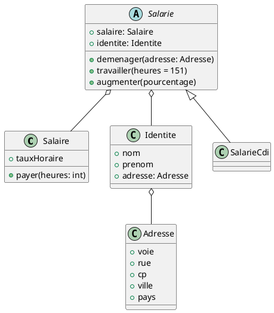

# TP 2

## Objectifs 🎯

L'objectif de ce TP est de mettre en place des tests unitaires sur une application de gestion de personnel.

## Rendu 📮

- Le TP est à rendre sur un répo GitHub
- Vous réaliserez un commit pour chaque classe,
- Vous réaliserez un commit par classe de test terminée.
- Le répo doit contenir un fichier `README.md` qui décrit les fonctionnalités du projet

## Evaluation 📝

Vous serez évalué sur :
- L'implémentation des features demandées
- La qualité du code
- La qualité des tests
- Le respect des bonnes pratiques
- La gestion des commits
- La documentation du code

## Consignes ⚙️

- Vous devez utiliser JUnit 5 pour les tests unitaires
- Vous devez utiliser Mockito pour les mocks
- Vous devez utiliser Maven pour gérer les dépendances et les tests
- Vous utiliserez des tests paramétrés lorsque cela est possible

> Libre à vous d'utiliser les auto-mocks ou les mocks manuels !

## Projet 📁

### Diagramme de classes 📊

Copiez-collez le code suivant dans [PlantText](https://www.planttext.com/) pour visualiser le diagramme de classes.

### Adresse

- La classe adresse ne dispose pas de logique à proprement parler
- Elle est utilisée pour stocker les informations d'adresse d'un salarié

> Faut-il tester cette classe ?

### Identité

- La classe identité ne dispose pas de logique non plus
- Elle est utilisée pour stocker les informations d'identité d'un salarié
- Elle possède une relation de composition avec la classe `Adresse`

> Faut-il tester cette classe ?

### Salaire

- La classe salaire sert à gérer le salaire d'un salarié
- Elle permet de gérer son taux horaire, et de calculer son salaire en fonction du nombre d'heures travaillées

#### Payer

- La méthode `payer` permet de calculer le salaire d'un salarié en fonction du nombre d'heures travaillées
- Les heures supplémentaires sont payées 25% plus cher que les heures normales  
- Une heure est considérée comme supplémentaire si le salarié a travaillé plus de 151.67 heures !

> Vous devrez certainement créer des méthodes privées pour vous aider à implémenter cette méthode !

### Salarie

- Classe abstraite qui représente un salarié
- Elle contient la logique commune à tous les salariés (bien qu'ici, nous n'ayons qu'un seul type de salarié)
- Elle possède une relation d'agrégation avec la classe `Salaire` et `Identite`

#### Travailler

- Cette méthode permet de faire travailler un salarié
- On indique le nombre d'heures travaillées en paramètre
- Elle appelle la méthode `payer` de la classe `Salaire` pour calculer le salaire du salarié
- Elle affiche dans la console : 'Le salarié Jean Dupont a travaillé X heures et a perçu Y euros'
- Elle peut aussi être appelée sans paramètres. On considère alors que le salarié a travaillé 151.67 heures

#### Déménager

- Cette méthode permet de changer l'adresse d'un salarié
- Elle prend en paramètre une adresse
- Elle ne retourne rien, et se contente de modifier l'adresse du salarié
- Pour ce faire, elle change l'objet `Adresse` de la classe `Identite`

#### Augmenter

- Cette méthode permet d'augmenter le salaire d'un salarié
- Elle prend en paramètres le pourcentage d'augmentation
- Elle modifie l'attribut `tauxHoraire` de la classe `Salaire` en fonction du pourcentage d'augmentation
- Rien n'est affiché dans la console.

### SalarieCdi

- Cette classe représente un salarié en CDI
- Elle hérite de la classe `Salarie`
- Elle n'implémente pas de logique supplémentaire

